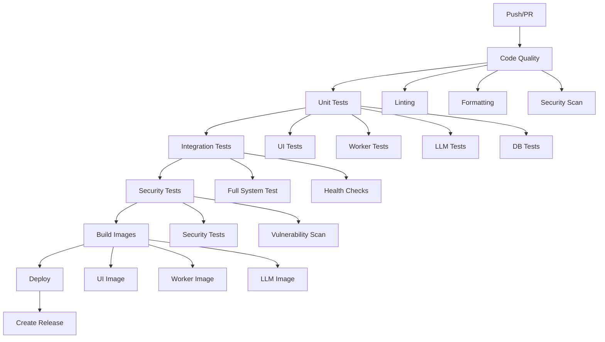

# 🚀 Руководство по CI/CD Pipeline

## 📋 Обзор

Этот проект использует GitHub Actions для автоматизации процессов Continuous Integration и Continuous Deployment (CI/CD). Pipeline автоматически тестирует код, собирает Docker образы и деплоит приложение.

## 🏗️ Архитектура CI/CD



## 🔄 Этапы Pipeline

### 1. 🔍 Проверка качества кода (Code Quality)

**Триггеры:** Каждый push и PR  
**Время выполнения:** ~2-3 минуты

**Что проверяется:**
- ✅ Форматирование кода (Black)
- ✅ Сортировка импортов (isort)
- ✅ Линтинг (Flake8)
- ✅ Проверка типов (mypy)
- ✅ Безопасность кода (Bandit)
- ✅ Уязвимости в зависимостях (Safety)

**Требования для прохождения:**
- Код должен соответствовать стандартам форматирования
- Импорты должны быть отсортированы
- Нет критических ошибок линтинга
- Нет критических проблем безопасности

### 2. 🧪 Unit тесты

**Триггеры:** После успешной проверки качества кода  
**Время выполнения:** ~5-8 минут

**Что тестируется:**
- ✅ UI компоненты (`ui/test_*.py`)
- ✅ Worker задачи (`worker/test_tasks.py`)
- ✅ LLM API (`llm/test_api.py`)
- ✅ Database модели (`db/test_models.py`)

**Требования для прохождения:**
- Все unit тесты должны пройти
- Покрытие кода должно быть не менее 80%
- Нет критических ошибок

### 3. 🔗 Integration тесты

**Триггеры:** После успешных unit тестов  
**Время выполнения:** ~10-15 минут

**Что тестируется:**
- ✅ Полный flow анализа текста
- ✅ Взаимодействие между сервисами
- ✅ Health checks всех сервисов
- ✅ Обработка ошибок
- ✅ Конкурентная обработка

**Инфраструктура:**
- Redis (порт 6379)
- PostgreSQL (порт 5432)
- ClickHouse (порт 8123)
- Ollama (порт 11434)

### 4. 🔒 Security тесты

**Триггеры:** После успешных unit тестов  
**Время выполнения:** ~3-5 минут

**Что проверяется:**
- ✅ Security тесты (`tests/test_security.py`)
- ✅ Сканирование на уязвимости (Trivy)
- ✅ Проверка секретов в коде
- ✅ Анализ зависимостей

### 5. 🐳 Сборка Docker образов

**Триггеры:** После успешных тестов  
**Время выполнения:** ~8-12 минут

**Что собирается:**
- ✅ UI образ (`pharma-analysis-ui`)
- ✅ Worker образ (`pharma-analysis-worker`)
- ✅ LLM образ (`pharma-analysis-llm`)

**Особенности:**
- Multi-platform сборка (linux/amd64, linux/arm64)
- Кэширование слоев Docker
- Автоматическая загрузка в GitHub Container Registry
- Тегирование по веткам и коммитам

### 6. 🚀 Деплой

**Триггеры:** Только для main ветки и релизов  
**Время выполнения:** ~5-10 минут

**Что происходит:**
- ✅ Автоматический деплой на production/staging
- ✅ Проверка здоровья сервисов
- ✅ Откат при ошибках
- ✅ Уведомления о статусе

### 7. 📦 Создание релиза

**Триггеры:** При создании GitHub релиза  
**Время выполнения:** ~2-3 минуты

**Что создается:**
- ✅ Архив исходного кода
- ✅ Прикрепление к GitHub релизу
- ✅ Тегирование Docker образов

## 🛠️ Локальная разработка

### Предварительные требования

```bash
# Установка необходимых инструментов
sudo apt-get update
sudo apt-get install -y python3 python3-pip docker.io docker-compose

# Проверка версий
python3 --version  # Должно быть 3.11+
docker --version
docker-compose --version
```

### Запуск локального CI/CD

```bash
# Запуск всех этапов
./scripts/ci-local.sh

# Запуск конкретного этапа
./scripts/ci-local.sh --stage code-quality
./scripts/ci-local.sh --stage unit-tests
./scripts/ci-local.sh --stage integration-tests
./scripts/ci-local.sh --stage security-tests
./scripts/ci-local.sh --stage build-images

# Очистка перед запуском
./scripts/ci-local.sh --cleanup

# Быстрый режим (пропустить некоторые проверки)
./scripts/ci-local.sh --quick
```

### Ручной запуск тестов

```bash
# Проверка качества кода
black --check ui/ worker/ llm/ db/ tests/
isort --check-only ui/ worker/ llm/ db/ tests/
flake8 ui/ worker/ llm/ db/ tests/
mypy ui/ worker/ llm/ db/
bandit -r ui/ worker/ llm/ db/
safety check

# Unit тесты
python -m pytest ui/test_*.py -v
python -m pytest worker/test_*.py -v
python -m pytest llm/test_*.py -v
python -m pytest db/test_*.py -v

# Integration тесты
python -m pytest tests/test_integration.py -v
python run_tests.py

# Security тесты
python -m pytest tests/test_security.py -v
```

## 🔧 Конфигурация

### Переменные окружения

Основные переменные в GitHub Actions:

```yaml
env:
  PYTHON_VERSION: '3.11'
  NODE_VERSION: '18'
  UI_IMAGE: pharma-analysis-ui
  WORKER_IMAGE: pharma-analysis-worker
  LLM_IMAGE: pharma-analysis-llm
  IMAGE_TAG: ${{ github.sha }}
  LATEST_TAG: latest
  DOCKER_REGISTRY: ghcr.io/${{ github.repository_owner }}
```

### Секреты

Необходимые секреты в GitHub:

- `GITHUB_TOKEN` - автоматически предоставляется GitHub
- `DEPLOY_USER` - пользователь для SSH деплоя (опционально)
- `DEPLOY_HOST` - хост для деплоя (опционально)
- `SLACK_WEBHOOK` - webhook для уведомлений (опционально)

### Настройка секретов

1. Перейдите в Settings → Secrets and variables → Actions
2. Нажмите "New repository secret"
3. Добавьте необходимые секреты

## 📊 Мониторинг и отчеты

### Артефакты

Pipeline создает следующие артефакты:

- `security-reports` - отчеты по безопасности (Bandit, Safety)
- `coverage-ui` - отчеты покрытия кода для UI
- `coverage-worker` - отчеты покрытия кода для Worker
- `coverage-llm` - отчеты покрытия кода для LLM
- `coverage-db` - отчеты покрытия кода для DB
- `test-results` - результаты тестов (JSON, Markdown)
- `security-test-results` - результаты security тестов

### Уведомления

Настроены уведомления для:
- ✅ Успешный деплой
- ❌ Ошибки в pipeline
- 🔄 Статус тестов

## 🚨 Устранение неполадок

### Частые проблемы

#### 1. Ошибки форматирования кода

```bash
# Исправление форматирования
black ui/ worker/ llm/ db/ tests/
isort ui/ worker/ llm/ db/ tests/

# Проверка
black --check ui/ worker/ llm/ db/ tests/
isort --check-only ui/ worker/ llm/ db/ tests/
```

#### 2. Ошибки линтинга

```bash
# Проверка ошибок
flake8 ui/ worker/ llm/ db/ tests/

# Исправление автоматически исправимых ошибок
autopep8 --in-place --recursive ui/ worker/ llm/ db/ tests/
```

#### 3. Ошибки тестов

```bash
# Запуск тестов с подробным выводом
python -m pytest tests/test_integration.py -v -s --tb=long

# Запуск конкретного теста
python -m pytest tests/test_integration.py::TestFullFlow::test_text_analysis_flow -v
```

#### 4. Проблемы с Docker

```bash
# Очистка Docker
docker system prune -a
docker volume prune

# Пересборка образов
docker-compose build --no-cache
```

#### 5. Проблемы с портами

```bash
# Проверка занятых портов
./pre-flight.sh

# Поиск процессов, использующих порты
lsof -i :8505
lsof -i :8000
lsof -i :6383
```

### Логи и отладка

#### Просмотр логов GitHub Actions

1. Перейдите в Actions вкладку репозитория
2. Выберите нужный workflow run
3. Нажмите на job для просмотра логов
4. Используйте фильтры для поиска ошибок

#### Локальная отладка

```bash
# Подробный вывод скрипта
bash -x ./scripts/ci-local.sh

# Проверка конкретного этапа
./scripts/ci-local.sh --stage code-quality --no-cleanup
```

## 🔄 Обновление CI/CD

### Добавление новых тестов

1. Создайте тест в соответствующей папке
2. Добавьте маркер в `pyproject.toml`
3. Обновите workflow при необходимости

### Добавление новых проверок

1. Добавьте инструмент в `pyproject.toml`
2. Обновите этап в `.github/workflows/ci.yml`
3. Добавьте в локальный скрипт `scripts/ci-local.sh`

### Изменение конфигурации

1. Обновите соответствующий конфигурационный файл
2. Протестируйте локально
3. Создайте PR с изменениями
4. Проверьте работу pipeline

## 📚 Дополнительные ресурсы

- [GitHub Actions Documentation](https://docs.github.com/en/actions)
- [Docker Documentation](https://docs.docker.com/)
- [Python Testing Guide](https://docs.python.org/3/library/unittest.html)
- [Pytest Documentation](https://docs.pytest.org/)
- [Black Documentation](https://black.readthedocs.io/)
- [Flake8 Documentation](https://flake8.pycqa.org/)

## 🤝 Поддержка

Если у вас возникли проблемы с CI/CD:

1. Проверьте логи в GitHub Actions
2. Запустите локальный pipeline: `./scripts/ci-local.sh`
3. Создайте issue в репозитории
4. Обратитесь к команде разработки

---

**Версия документации:** 1.0.0  
**Дата обновления:** 2024-12-30  
**Статус:** ✅ Актуально
